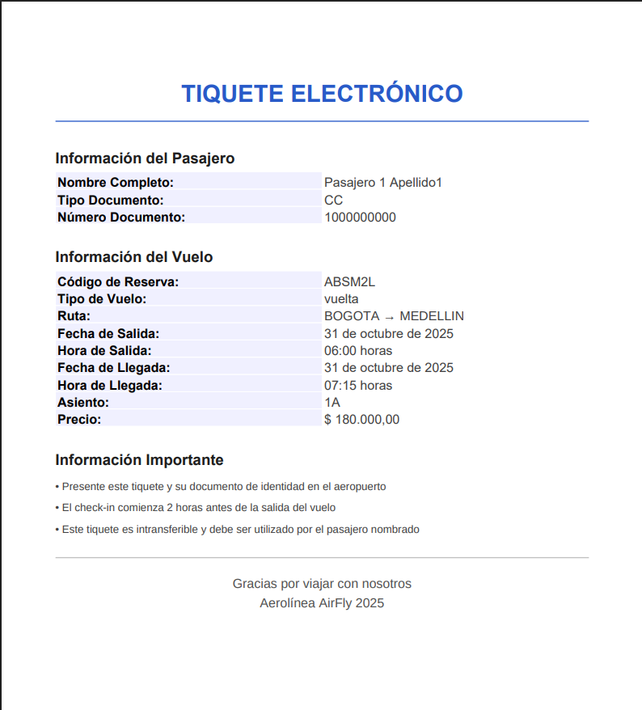

# Guía de Usuario — API de Vuelos ✈️

- 📘 [Guía de Usuario](docs/1_Guia_Usuario.md)
- 🧩 [Arquitectura](docs/2_Arquitectura.md)
- 🚀 [Guía de Despliegue](docs/4_Despliegue.md)
- 🧪 [Tests](docs/4_Tests.md)
- 📄 [Swagger UI](http://localhost:8080/swagger-ui.html)

## Descripción
Esta API permite buscar vuelos, seleccionar asientos y simular pagos.
puede ser usada para implementarse en un sistema de gestion de vuelos para una aerolinea

Base URL: `http://localhost:8080/api`

---

## Endpoints principales

### 🔹 GET /vuelos/disponibles
Obtiene la lista de vuelos disponibles.

**Ejemplo de respuesta:**
```json
[
  {
    "idVuelo": 1,
    "origen": "BOGOTA",
    "destino": "MEDELLIN",
    "fechaSalida": "2025-10-31T06:00:50",
    "fechaLlegada": "2025-10-31T07:15:50",
    "precio": 180000.00,
    "avion": {
      "idAvion": 1,
      "modelo": "Boeing 737-800",
      "capacidad": 189
    },
    "asientosDisponibles": 184,
    "duracionMinutos": 75
  },
  {
    "idVuelo": 2,
    "origen": "BOGOTA",
    "destino": "CALI",
    "fechaSalida": "2025-10-31T08:30:50",
    "fechaLlegada": "2025-10-31T09:30:50",
    "precio": 165000.00,
    "avion": {
      "idAvion": 2,
      "modelo": "Airbus A320",
      "capacidad": 180
    },
    "asientosDisponibles": 180,
    "duracionMinutos": 60
  }
]
```
### 🔹 POST /vuelos/filtrar
Obtiene la lista de vuelos filtrando por campos obligatorios los cuales son:

**Parámetros Obligatorios:**
- `origen` CiudadesEnum
- `destino` 
- `tipoViaje` String ("ida", "ida y vuelta")

**Parámetro Opcional para ida y vuelta:**

- `fechaRegreso` LocalDate

**Ejemplo de peticion valida:**
```json
  {
    "origen" : "BOGOTA",
    "destino" : "MEDELLIN",
    "fechaSalida" : "2025-10-31T14:30:00",
    "tipoViaje" : "ida"
  }
```

**Ejemplo de respuesta:**
```json
{
  "vuelosIda": [
    {
      "idVuelo": 1,
      "origen": "BOGOTA",
      "destino": "MEDELLIN",
      "fechaSalida": "2025-10-31T06:00:50",
      "fechaLlegada": "2025-10-31T07:15:50",
      "precio": 180000.00,
      "avion": {
        "idAvion": 1,
        "modelo": "Boeing 737-800",
        "capacidad": 189
      },
      "asientosDisponibles": 184,
      "duracionMinutos": null
    },
    {
      "idVuelo": 14,
      "origen": "BOGOTA",
      "destino": "MEDELLIN",
      "fechaSalida": "2025-10-31T18:00:50",
      "fechaLlegada": "2025-10-31T19:15:50",
      "precio": 195000.00,
      "avion": {
        "idAvion": 2,
        "modelo": "Airbus A320",
        "capacidad": 180
      },
      "asientosDisponibles": 180,
      "duracionMinutos": null
    }
  ],
  "vuelosVuelta": []
}
```

### 🔹 GET /tiquetes/{idTiquete}/pdf
Obtiene un tiquete en pdf.

**Ejemplo de respuesta:**


### 🔹 GET /vuelos/{idVuelo}/asientos
Obtiene la lista de asientos disponibles en un vuelo.

**Ejemplo de respuesta:**
```json
[
  {
    "idAsientoVuelo": 3,
    "disponible": true,
    "nombreAsiento": "1C",
    "idAsiento": 3
  },
  {
    "idAsientoVuelo": 4,
    "disponible": true,
    "nombreAsiento": "1D",
    "idAsiento": 4
  }
]
```

### 🔹 POST /pagos/simular
Hace la simulacion de un pago con datos falsos dando una probabilidad de 80% acierto y 20% fallo.

**Ejemplo de peticion valida:**
```json
{
  "idReserva" : 1,
  "idsVuelos" : [1],
  "metodoPago" : "PSE",
  "nombrePagador" : "Andres Ramirez",
  "tipoDocumentoPagador" : "CC",
  "numeroDocumentoPagador" : "1234567890",
  "correoPagador" : "andres@gmail.com",
  "telefonoPagador" : "9876543210",
  "terminosAceptados" : true
}
```

**Ejemplo de error:**
```json
{
  "exitoso": false,
  "mensaje": "Debe aceptar los términos y condiciones",
  "codigoTransaccion": null,
  "pago": null,
  "estado": null
}
```

**Ejemplo de respuesta:**
```json
{
  "exitoso": true,
  "mensaje": "Pago procesado exitosamente",
  "codigoTransaccion": "901052cf-8ee7-4cc4-8992-bf7de325f197",
  "pago": {
    "idPago": 10,
    "fecha": "2025-10-27T17:56:20.1832895",
    "valorAPagar": 360000,
    "metodoPago": "PSE",
    "usuario": null,
    "estado": "APROBADO"
  },
  "estado": null
}
```

### SOLO PARA ADMINS CON TOKEN JWT
Authorization: 'Bearer token' en cabeceras


### 🔹 GET /reservas/
Obtiene toda la informacion de todas las reservas del sistema

**Ejemplo de respuesta:**
```json
[
  {
    "idReserva": 1,
    "fecha": "2025-10-26T18:18:51",
    "pago": {
      "idPago": 10,
      "fecha": "2025-10-27T17:56:20",
      "valorAPagar": 360000,
      "metodoPago": "PSE",
      "usuario": null,
      "estado": "APROBADO"
    },
    "pasajeros": [
      {
        "idPasajero": 1,
        "primerApellido": "Apellido1",
        "segundoApellido": "Segundo1",
        "nombres": "Pasajero 1",
        "fechaNacimiento": "2000-10-26",
        "genero": "M",
        "tipoDocumento": "CC",
        "numeroDocumento": "1000000000",
        "telefono": "3000000000",
        "email": "pasajero1@email.com",
        "infante": false
      },
      {
        "idPasajero": 2,
        "primerApellido": "Apellido2",
        "segundoApellido": "Segundo2",
        "nombres": "Pasajero 2",
        "fechaNacimiento": "1999-10-26",
        "genero": "F",
        "tipoDocumento": "CC",
        "numeroDocumento": "1000000001",
        "telefono": "3000000001",
        "email": "pasajero2@email.com",
        "infante": false
      }
    ],
    "tiquetes": [
      {
        "idTiquete": 1,
        "codigoReserva": "ABSM2L",
        "vuelo": {
          "idVuelo": 1,
          "origen": "BOGOTA",
          "destino": "MEDELLIN",
          "fechaSalida": "2025-10-31T06:00:50",
          "fechaLlegada": "2025-10-31T07:15:50",
          "precio": 180000.00,
          "avion": {
            "idAvion": 1,
            "modelo": "Boeing 737-800",
            "capacidad": 189
          },
          "asientosDisponibles": null,
          "duracionMinutos": null
        },
        "asientoVuelo": {
          "idAsientoVuelo": 1,
          "disponible": false,
          "nombreAsiento": "1A",
          "idAsiento": 1
        },
        "pasajero": {
          "idPasajero": 1,
          "primerApellido": "Apellido1",
          "segundoApellido": "Segundo1",
          "nombres": "Pasajero 1",
          "fechaNacimiento": "2000-10-26",
          "genero": "M",
          "tipoDocumento": "CC",
          "numeroDocumento": "1000000000",
          "telefono": "3000000000",
          "email": "pasajero1@email.com",
          "infante": false
        },
        "pago": {
          "idPago": 2,
          "fecha": "2025-10-26T18:18:51",
          "valorAPagar": 180000,
          "metodoPago": "TARJETA_CREDITO",
          "usuario": {
            "idUsuario": 1,
            "email": "juan.rodriguez@email.com",
            "password": "password123",
            "nombre": null,
            "roles": []
          },
          "estado": "APROBADO"
        }
      },
      {
        "idTiquete": 2,
        "codigoReserva": "ABSM2L",
        "vuelo": {
          "idVuelo": 1,
          "origen": "BOGOTA",
          "destino": "MEDELLIN",
          "fechaSalida": "2025-10-31T06:00:50",
          "fechaLlegada": "2025-10-31T07:15:50",
          "precio": 180000.00,
          "avion": {
            "idAvion": 1,
            "modelo": "Boeing 737-800",
            "capacidad": 189
          },
          "asientosDisponibles": null,
          "duracionMinutos": null
        },
        "asientoVuelo": {
          "idAsientoVuelo": 2,
          "disponible": false,
          "nombreAsiento": "1B",
          "idAsiento": 2
        },
        "pasajero": {
          "idPasajero": 2,
          "primerApellido": "Apellido2",
          "segundoApellido": "Segundo2",
          "nombres": "Pasajero 2",
          "fechaNacimiento": "1999-10-26",
          "genero": "F",
          "tipoDocumento": "CC",
          "numeroDocumento": "1000000001",
          "telefono": "3000000001",
          "email": "pasajero2@email.com",
          "infante": false
        },
        "pago": {
          "idPago": 3,
          "fecha": "2025-10-26T18:18:51",
          "valorAPagar": 180000,
          "metodoPago": "TARJETA_CREDITO",
          "usuario": {
            "idUsuario": 1,
            "email": "juan.rodriguez@email.com",
            "password": "password123",
            "nombre": null,
            "roles": []
          },
          "estado": "APROBADO"
        }
      }
    ],
    "codigoReserva": "ABSM2L"
  }
]
```