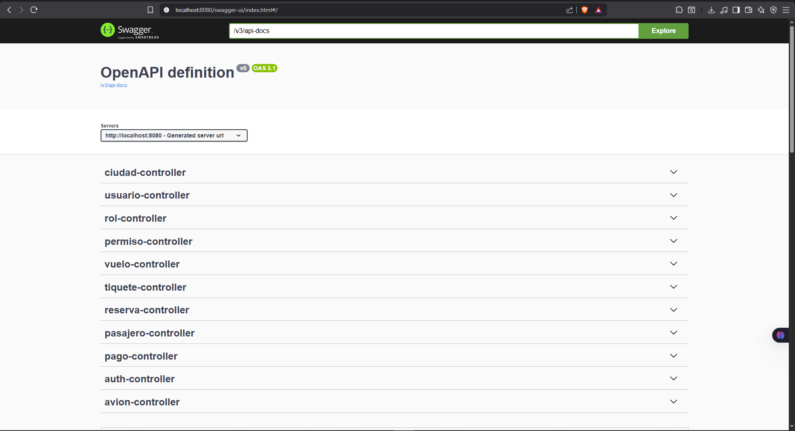
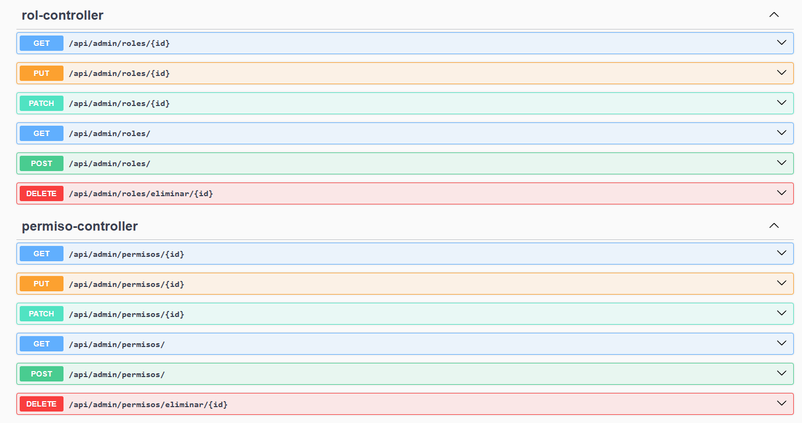
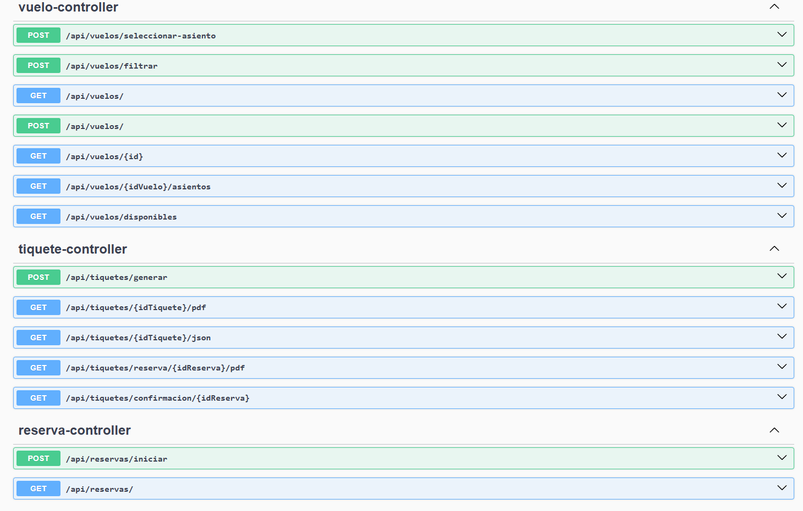
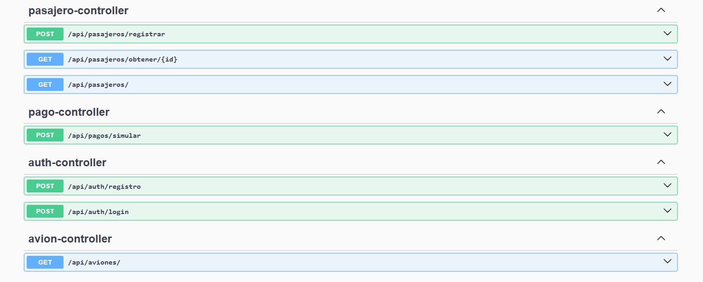

# Imagenes de swagger

- 📘 [Guía de Usuario](docs/1_Guia_Usuario.md)
- 🧩 [Arquitectura](docs/2_Arquitectura.md)
- 🚀 [Guía de Despliegue](docs/4_Despliegue.md)
- 🧪 [Tests](docs/4_Tests.md)
- 📄 [Swagger UI](http://localhost:8080/swagger-ui.html)

### Controllers

### Endpoints por controllers

