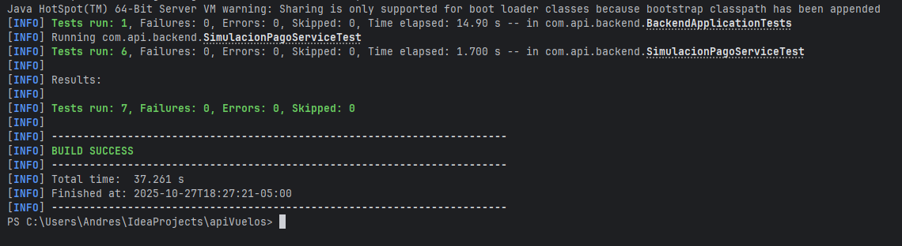

# Documentación de Pruebas Automatizadas — Módulo de Simulación de Pago

## Objetivo de las pruebas

El propósito de las pruebas automatizadas es validar el correcto funcionamiento de la lógica de negocio del módulo **Simulación de Pago**, perteneciente al sistema backend desarrollado con **Spring Boot**.  
Estas pruebas garantizan que el flujo de simulación y registro de pagos responda adecuadamente ante diferentes escenarios de entrada y errores de usuario.

---

## Tecnologías utilizadas

- **JUnit 5 (Jupiter)** → Framework principal para las pruebas unitarias.
- **Mockito** → Para simular repositorios y servicios (mocking).
- **Spring Boot Test** → Integración con el contexto de Spring.
- **ModelMapper (Spy)** → Validación parcial de mapeos entre entidades y DTOs.
- **Maven Surefire Plugin** → Ejecución de pruebas.
- **Jacoco** → Generación de reportes de cobertura de código.

---

## Clase de prueba: `SimulacionPagoServiceTest`

Ubicación:

src/test/java/com/api/backend/SimulacionPagoServiceTest.java

### Dependencias simuladas

| Dependencia simulada | Descripción |
|----------------------|-------------|
| `ReservaRepository` | Verifica la existencia de una reserva. |
| `VueloRepository` | Obtiene la información de los vuelos seleccionados. |
| `PasajeroRepository` | Verifica si la reserva tiene pasajeros asociados. |
| `PagoRepository` | Registra el pago simulado en la base de datos. |

---

## 🧠 Lógica evaluada en las pruebas

Cada prueba cubre un flujo específico dentro del método `simularPago()` del servicio `PagoImplement`:

| Caso de prueba | Objetivo | Resultado esperado |
|----------------|-----------|--------------------|
| `debeFallarSiNoAceptaTerminos()` | Verifica que no se pueda continuar si no se aceptan los términos. | `res.isExitoso() == false` y mensaje *"Debe aceptar los términos y condiciones"*. |
| `debeFallarSiFaltaNombrePagador()` | Verifica que el nombre del pagador sea obligatorio. | `res.isExitoso() == false` y mensaje *"El nombre del pagador es requerido"*. |
| `debeFallarSiReservaNoExiste()` | Simula que la reserva no existe en la base de datos. | Lanza `RuntimeException` con mensaje *"Reserva no encontrada"*. |
| `debeFallarSiNoHayVuelos()` | Simula que no se seleccionan vuelos para pagar. | `res.isExitoso() == false` y mensaje *"No se seleccionaron vuelos para el pago."*. |
| `debeFallarSiNoHayPasajeros()` | Verifica que no se permita procesar si la reserva no tiene pasajeros. | Lanza `RuntimeException` con mensaje *"No se han registrado pasajeros para esta reserva."*. |
| `debeProcesarPagoCorrectamente()` | Simula un flujo exitoso de pago. | `res.isExitoso() == true`, mensaje *"Pago procesado exitosamente"*, y estado `"APROBADO"`. |

---

## 📄 Ejemplo de prueba (flujo exitoso)

```java
@Test
void debeProcesarPagoCorrectamente() {
    SimulacionPagoRequest req = crearRequestValido();
    when(reservaRepository.findById(1L)).thenReturn(Optional.of(reserva));
    when(pasajeroRepository.countByReserva(reserva)).thenReturn(2L);
    when(vueloRepository.findAllById(req.getIdsVuelos())).thenReturn(List.of(vuelo1, vuelo2));

    Pago pagoGuardado = new Pago();
    pagoGuardado.setIdPago(99L);
    pagoGuardado.setValorAPagar(900000L);
    pagoGuardado.setFecha(LocalDateTime.now());
    pagoGuardado.setEstadoPago("APROBADO");
    when(pagoRepository.save(any())).thenReturn(pagoGuardado);

    SimulacionPagoResponse res = pagoImplement.simularPago(req);

    assertTrue(res.isExitoso());
    assertEquals("Pago procesado exitosamente", res.getMensaje());
    assertNotNull(res.getCodigoTransaccion());
    assertEquals("APROBADO", res.getPago().getEstado());
}
```
### Imagen demostrativa de los tests pasados
